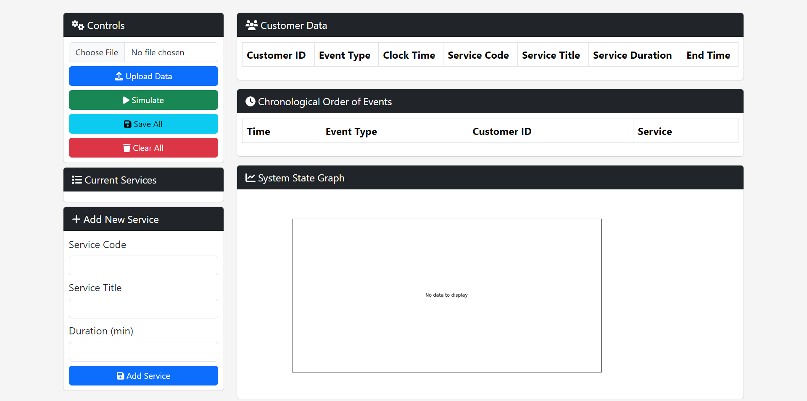
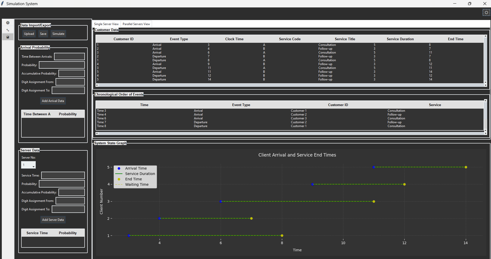

# Queuing System Simulation

This is a **Queuing System Simulation** tool built using **Python** and **Tkinter**. The application allows users to simulate a queuing system by generating customers with random arrival times and assigned services. The system displays customer events in a table and a dynamic graph to visualize the state of the queue over time. 

## Features

- **Upload Service Data**: Upload service data from an Excel or CSV file with `Code`, `Title`, and `Duration` columns.
- **Generate Random Customers**: Automatically generate 7 customers with random arrival intervals and assigned services.
- **System State Graph**: Visualize the queue's state over time with a dynamic graph.
- **Save Customer Data**: Save customer event data to an Excel or CSV file.
- **Clear Data**: Clear all customer data and reset the table and graph.

## Demo
### Web-App


### Desktop-App


## Installation

1. **Clone the Repository**:
   ```bash
   git clone https://github.com/your-username/queuing-system-simulation.git
   cd queuing-system-simulation
   ```

2. **Create a Virtual Environment** (optional but recommended):
   ```bash
   python -m venv venv
   source venv/bin/activate  # On Windows, use `venv\Scripts\activate`
   ```

3. **Install Dependencies**:
   ```bash
   pip install -r requirements.txt
   ```

4. **Run the Application**:
   ```bash
   python app.py
   ```

## Usage

1. **Upload Service Data**:
   - Click the **Upload Service Data** button and select an Excel or CSV file.
   - The file must contain three columns: `Code`, `Title`, and `Duration`.

2. **Generate Customers**:
   - Click the **Generate Customers** button to create 7 customers with random arrival intervals and service assignments.
   - Customer events will appear in the table and be plotted on the graph.

3. **Save Data**:
   - Click the **Save All Data** button to export the current data as an Excel or CSV file.

4. **Clear Data**:
   - Click the **Clear All** button to reset the table and graph.

## Data File Format

The uploaded service data file (Excel/CSV) should have the following columns:

| Code | Title          | Duration |
|------|----------------|----------|
| S1   | Service 1      | 5        |
| S2   | Service 2      | 3        |
| S3   | Service 3      | 8        |

## Dependencies

Make sure the following libraries are installed:

- **pandas**: Data handling  
- **matplotlib**: Plotting the queue graph  
- **tkinter**: GUI development (comes pre-installed with Python)

You can install all dependencies using:
```bash
pip install pandas matplotlib
```

## Project Structure

```
queuing-system-simulation/
│
├── app.py                # Main application code
├── queuing_data.xlsx     # Example service data (optional)
├── requirements.txt      # Dependencies
└── README.md             # Project documentation
```

## Contributing

Contributions are welcome! Please follow these steps:

1. Fork the repository.
2. Create a new branch:  
   ```bash
   git checkout -b feature/your-feature-name
   ```
3. Make your changes and commit them:  
   ```bash
   git commit -m "Add your feature"
   ```
4. Push to the branch:  
   ```bash
   git push origin feature/your-feature-name
   ```
5. Open a pull request.

## License

This project is licensed under the MIT License - see the [LICENSE](LICENSE) file for details.
