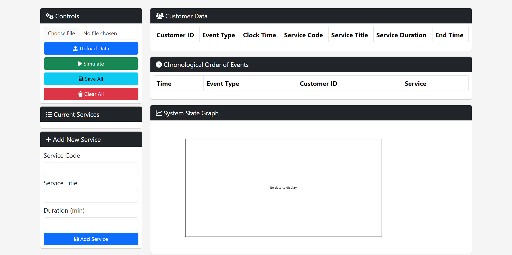
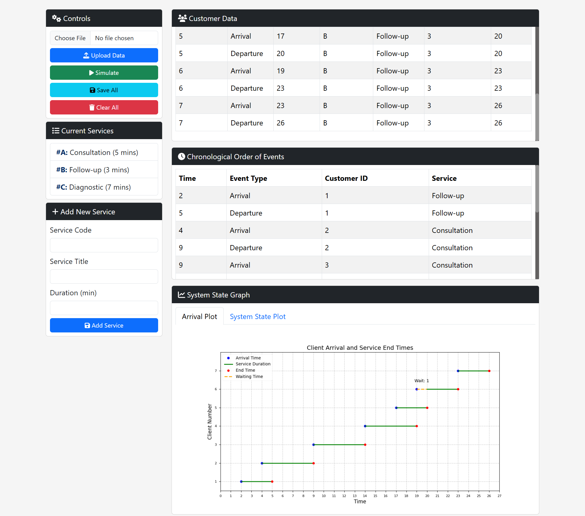
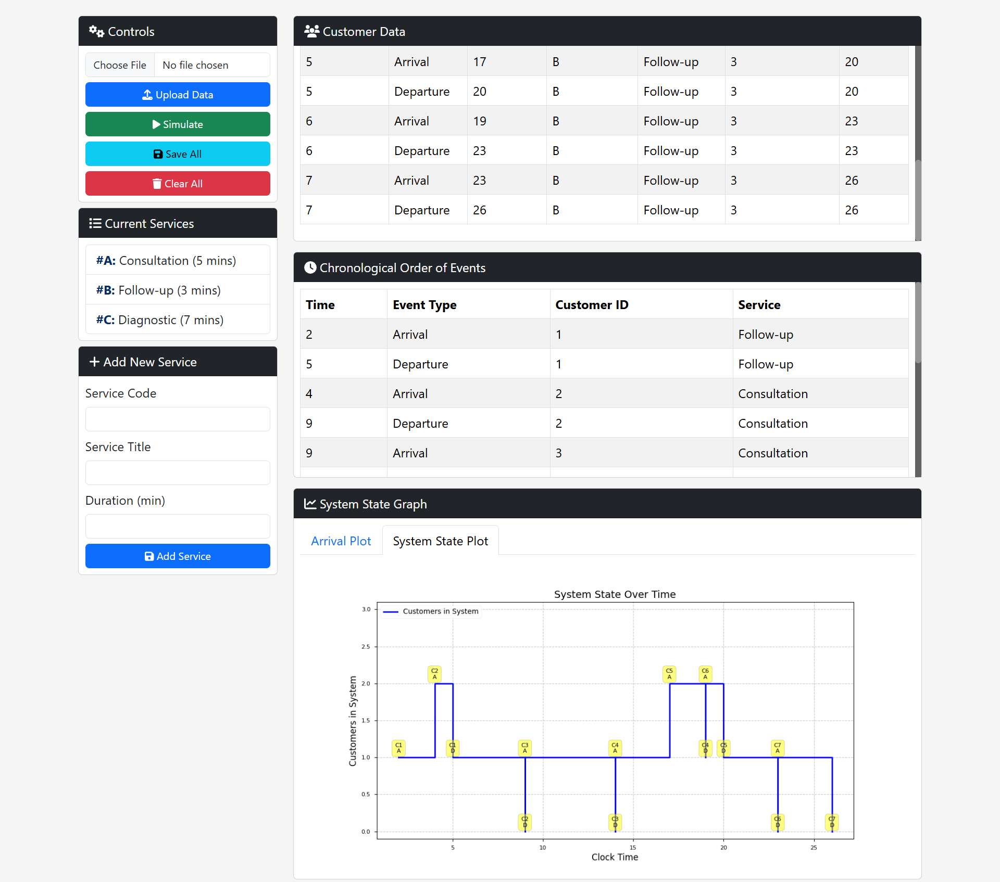
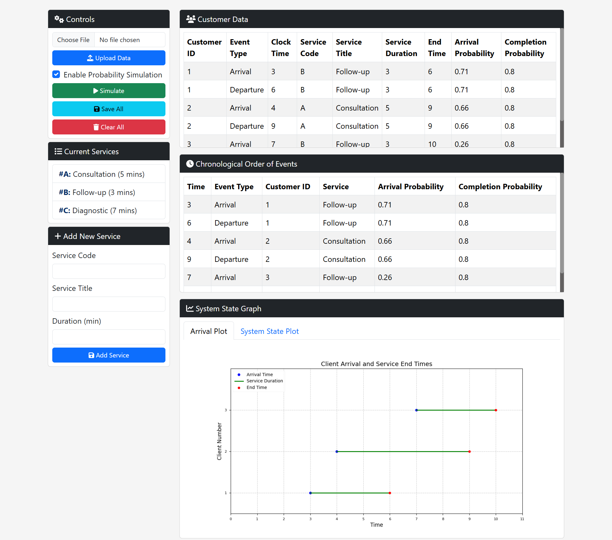
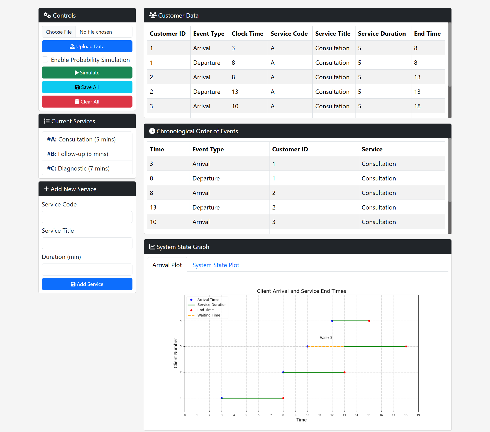
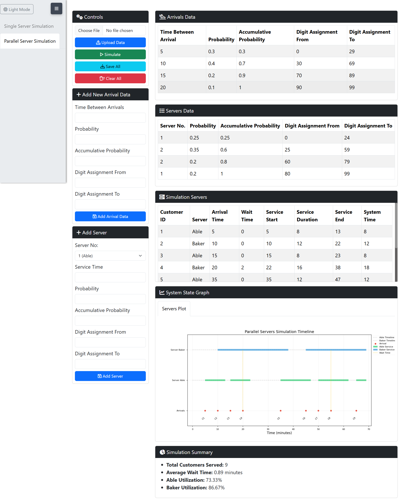
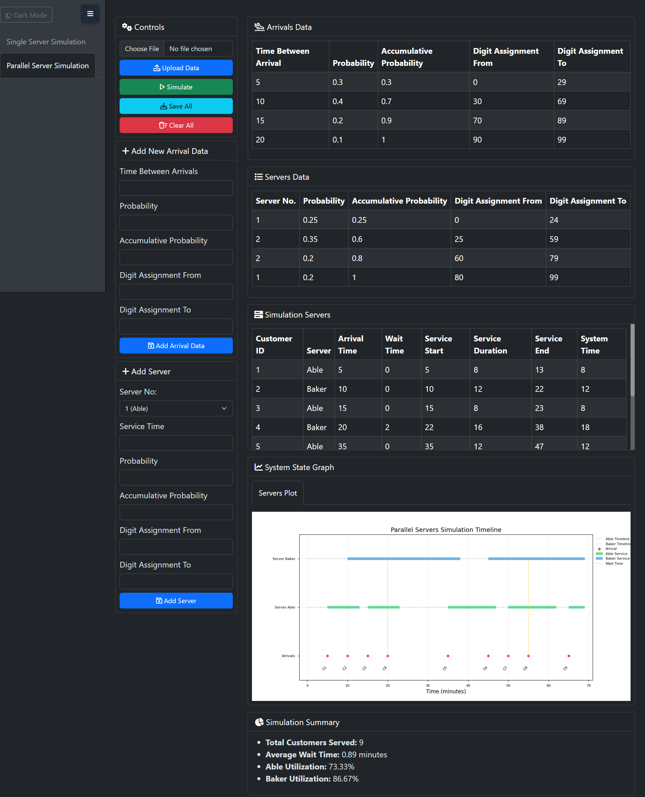
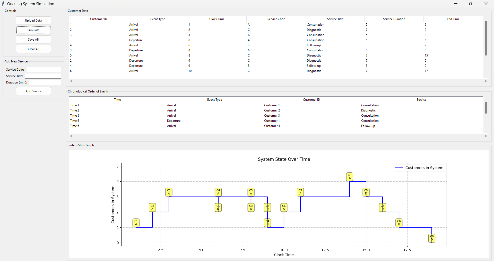

# Queuing System Simulation

This is a **Queuing System Simulation** tool built using **Python** and **Flask**. The web application allows users to simulate a queuing system by generating customers with random arrival times and assigned services. It displays customer events in a table and a dynamic graph to visualize the state of the queue over time.

## Features

- **Upload Service Data**: Upload service data from an Excel or CSV file with `Code`, `Title`, and `Duration` columns.
- **Generate Random Customers**: Automatically generate 7 customers with random arrival intervals and assigned services.
- **System State Graph**: Visualize the queue's state over time with a dynamic graph.
- **Save Customer Data**: Save customer event data to an Excel or CSV file.
- **Clear Data**: Clear all customer data and reset the table and graph.

## Demo
### Web-App (Version 1)


### Web-App (Version 1.2)



### Web-App (Version 1.3)



### Web-App (Version 1.5)



### Desktop-App


## Installation

1. **Clone the Repository**:
   ```bash
   git clone https://github.com/Mohamed-Hamdey/Simulation-System.git
   cd Simulation-System
   ```

2. **Create a Virtual Environment** (optional but recommended):
   ```bash
   python -m venv venv
   source venv/bin/activate  # On Windows, use `venv\Scripts\activate`
   ```

3. **Install Dependencies**:
   ```bash
   pip install -r requirements.txt
   ```

4. **Run the Application**:
   ```bash
   python app.py
   ```

## Usage

1. **Upload Service Data**:
   - Click the **Upload Service Data** button and select an Excel or CSV file.
   - The file must contain three columns: `Code`, `Title`, and `Duration`.

2. **Generate Customers**:
   - Click the **Generate Customers** button to create 7 customers with random arrival intervals and service assignments.
   - Customer events will appear in the table and be plotted on the graph.

3. **Save Data**:
   - Click the **Save All Data** button to export the current data as an Excel or CSV file.

4. **Clear Data**:
   - Click the **Clear All** button to reset the table and graph.

## Data File Format

The uploaded service data file (Excel/CSV) should have the following columns:

| Code | Title          | Duration |
|------|----------------|----------|
| S1   | Service 1      | 5        |
| S2   | Service 2      | 3        |
| S3   | Service 3      | 8        |

## Dependencies

Make sure the following libraries are installed:

- **Flask**: The web framework for building the application.
- **pandas**: For data handling and manipulation.
- **openpyxl**: For reading and writing Excel files.
- **matplotlib**: For plotting
- **jQuery**: For simplifying JavaScript coding (included in the static assets).

You can install all dependencies using:
```bash
pip install pandas matplotlib
```

## Project Structure
```
Simulation-System/
│
├── webApp/                      # Main directory for the web application.
│     ├── services/              # Contains service layer implementations and interfaces.
│     │      ├── interfaces/     # Defines interfaces for services.
│     │      │      ├── i.data_service.py       # Interface for data service operations.
│     │      │      ├── i.plots_service.py      # Interface for plot service operations.
│     │      │      └── i.simulation_service.py  # Interface for simulation service operations.
│     │      │
│     │      ├── __init__.py     # Initializes the services package.
│     │      ├── data_service.py  # Implementation of data service functionalities.
│     │      ├── plot_service.py  # Implementation of plotting functionalities.
│     │      └── simulation_service.py  # Implementation of simulation-related functionalities.
│     │
│     ├── static/                # Contains static assets for the web application.
│     │      ├── assets/         # Contains additional assets, such as fonts.
│     │      │      ├── font-awesome/*  # Font Awesome icons and related files.
│     │      │      └── favicon.ico     # Favicon for the Web App
│     │      │
│     │      ├── css/            # Contains CSS stylesheets for the application.
│     │      │     ├── bootstrap.min.css  # Minified Bootstrap CSS file.
│     │      │     └── styles.css  # Custom stylesheet for the application.
│     │      │
│     │      ├── js/             # Contains JavaScript files for interactivity.
│     │      │    ├── bootstrap.bundle.min.js     # Minified Bootstrap JavaScript bundle.
│     │      │    ├── jquery.min.js               # Minified jQuery library.
│     │      │    ├── main.js                     # Main JavaScript file for global functions.
│     │      │    ├── templates.js                # JavaScript for handling HTML templates.
│     │      │    ├── utils.js                    # Utility functions for the application.
│     │      │    ├── ajax.js                     # JavaScript for AJAX requests.
│     │      │    ├── singleServer.js             # JavaScript for single-server simulation.
│     │      │    └── parallelServer.js           # JavaScript for parallel-server simulation.
│     │      │
│     │      └── templates/       # Contains HTML templates for rendering views.
│     │             ├── arrivalRowTemplate.html   # Template for rendering arrival rows.
│     │             ├── customerRowTemplate.html  # Template for rendering customer rows.
│     │             ├── eventRowTemplate.html     # Template for rendering event rows.
│     │             ├── serverRowTemplate.html    # Template for rendering server rows.
│     │             ├── serversRowTemplate.html   # Template for rendering servers simulation result rows.
│     │             ├── serviceItemTemplate.html  # Template for rendering service items.
│     │             └── flash-messages.html       # Template for displaying flash messages.
│     │
│     ├── templates/
│     │     ├── layout.html                 # Base layout template for the app.
│     │     ├── partials/
│     │     │   ├── header.html             # Header with metadata, and stylesheets.
│     │     │   ├── navbar.html             # Navigation bar (Sidebar).
│     │     │   ├── footer.html             # Footer with scripts.
│     │     │   ├── content.html            # Main content area to be extended in each page.
│     │     │   ├── flash-messages.html     # Flash Messages container
│     │     │   └── modals.html             # Any modals used across the application.
│     │     │
│     │     ├──servers/
│     │     │   ├── single_server.html      # Content of single server tab.
│     │     │   └── parallel_server.html    # Content of parallel server tab.
│     │     │
│     │     └── index.html                  # Main page that extends layout.html.
│     │     
│     └── app.py                  # Main application code and entry point for the web application.
│
├── .gitignore                    # Git ignore file to exclude files from version control.
├── queuing_data.xlsx             # Example service data file (optional).
├── requirements.txt              # Lists the dependencies required for the project.
└── README.md                     # Project documentation including setup and usage instructions.
```

## Contributing

Contributions are welcome! Please follow these steps:

1. Fork the repository.
2. Create a new branch:  
   ```bash
   git checkout -b feature/your-feature-name
   ```
3. Make your changes and commit them:  
   ```bash
   git commit -m "Add your feature"
   ```
4. Push to the branch:  
   ```bash
   git push origin feature/your-feature-name
   ```
5. Open a pull request.

## License

This project is licensed under the MIT License - see the [LICENSE](LICENSE) file for details.